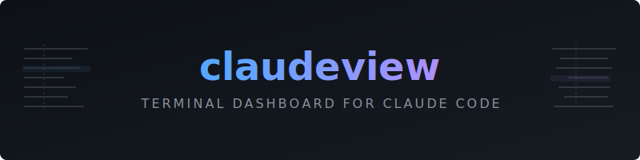
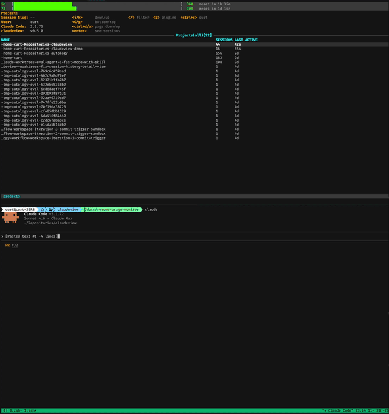

<p align="center">
  
</p>

**What is it?**

claudeview is a zero-setup TUI that gives you full observability into Claude Code sessions. It reads `~/.claude/` directly — no hooks, no config, no agents to run. Projects, sessions, agents, tool calls, plugins, and memories are all navigable from a single terminal interface with live-streaming updates.

<p align="center">
  
</p>

**Core Design**

The dashboard follows the k9s model: hierarchical drill-down with vim-style navigation. `j/k` to move, `enter` to drill down, `esc` to go back, `/` to filter. Every view refreshes on a 1-second tick, and the history view supports follow mode — auto-scrolling to the latest turn like `tail -f` as Claude writes.

**Key Capabilities**

1. **Session hierarchy** — projects, sessions, agents, and tool calls in a single navigable tree
2. **Slug grouping** — related sessions (plan/execute transitions sharing a slug) collapse into a single row with aggregated stats and a merged history view separated by divider rows
3. **Subagent visibility** — full agent tree with types, status, and embedded transcript rendering in the history view
4. **Live follow mode** — history view streams new turns as they arrive; scroll up to lock position, `G` to re-enable
5. **Plugin and memory inspection** — jump to plugins (`p`) or memories (`m`) from any view, with state preserved for `esc`-to-restore
6. **Detail views** — expanded content with thinking blocks, tool call inputs/outputs, and per-model token counts

**Data Model**

claudeview reads directly from Claude Code's local storage:

```
~/.claude/projects/<hash>/
├── <session-id>.jsonl              main agent transcript
└── <session-id>/subagents/
    └── agent-<id>.jsonl            subagent transcripts
~/.claude/plugins/                  plugin metadata
~/.claude/settings.json             MCP server config
```

Transcript parsing is incremental and offset-based — only new bytes are read on each tick, keeping the dashboard responsive even with large session files.

**Getting Started**

Install the latest release:

```bash
curl -fsSL https://raw.githubusercontent.com/Curt-Park/claudeview/main/install.sh | bash
```

Or build from source:

```bash
git clone https://github.com/Curt-Park/claudeview.git
cd claudeview
make install
```

Then run `claudeview` to start on the projects view, or `claudeview --demo` with synthetic data. To self-update to the latest release:

```bash
claudeview --update
```

**Development**

The recommended setup uses [mise](https://mise.run) for tool management. After cloning, `mise trust && mise install` handles Go and linter setup. Key targets:

```bash
make build    # build binary
make test     # run tests with race detector
make lint     # golangci-lint
make demo     # build and run demo mode
```

For the full UI specification, keybindings, and column definitions see [`docs/ui-spec.md`](docs/ui-spec.md). Internal documentation under `docs/` is kept in sync with the codebase via [autology](https://github.com/Curt-Park/autology).

**License**

MIT
